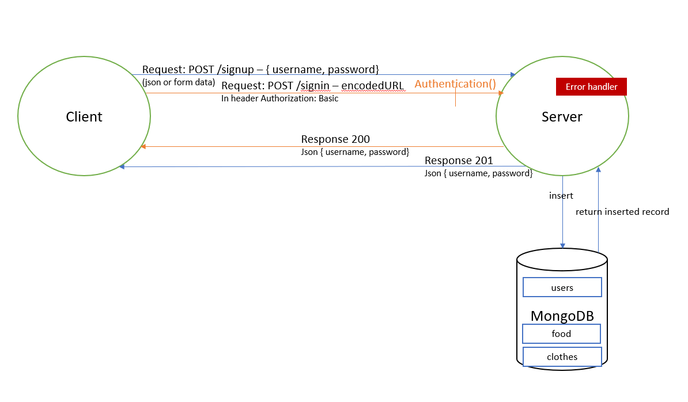
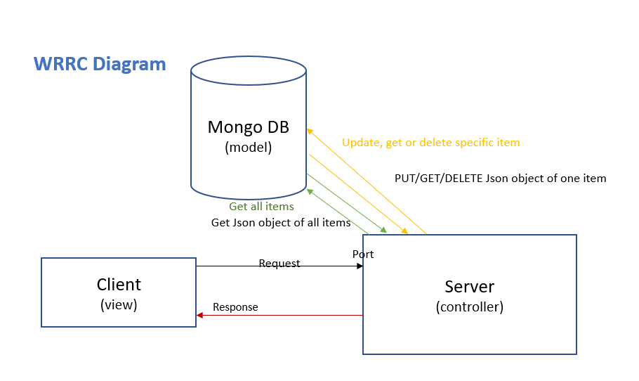

# LAB - Class 08

## Project: Auth API Server

### Author: Dina Ayoub

### Links and Resources

- [ci/cd](https://github.com/Dina-401-Advanced-Javascript/auth-api/actions) (GitHub Actions)
- [back-end server url on heroku](https://dina-auth-api.herokuapp.com/)

### Setup

#### `.env` requirements (where applicable)

- `PORT` - Port Number, 3000 for us
- `MONGODB_URI` - the uri including username and password to your mongo db
- `SECRET` - the secret to use for creating jwt tokens

#### How to initialize/run your application (where applicable)

- `npm start`

#### How to use this api

- POST /signup accepts a json body or a form with username and password fields and creates them in the db
- POST /signin accepts a username and password in basic auth headers (url encoded password)

Unauthenticated:
- POST /api/v1/food or /api/v1/clothes
- GET /api/v1/food or /api/v1/clothes
- GET /api/v1/food/\<id> or /api/v1/clothes/\<id>
- PUT /api/v1/food/\<id> or /api/v1/clothes/\<id>
- DELETE /api/v1/food/\<id> or /api/v1/clothes/\<id>

Authenticated (send bearer auth token from /signup):
- POST /api/v2/food or /api/v2/clothes
- GET /api/v2/food or /api/v2/clothes
- GET /api/v2/food/\<id> or /api/v2/clothes/\<id>
- PUT /api/v2/food/\<id> or /api/v2/clothes/\<id>
- DELETE /api/v2/food/\<id> or /api/v2/clothes/\<id>

#### Tests

- `npm test`
- Tests check:
AUTH Routes
  - POST /signup creates a new user and sends an object with the user and the token to the client
  - POST /signin with basic authentication headers logs in a user and sends an object with the user and the token to the client

V1 (Unauthenticated API) routes
  - POST /api/v1/:model adds an item to the DB and returns an object with the added item
  - GET /api/v1/:model returns a list of :model items
  - GET /api/v1/:model/ID returns a single item by ID
  - PUT /api/v1/:model/ID returns a single, updated item by ID
  - DELETE /api/v1/:model/ID returns an empty object. Subsequent GET for the same ID should result in nothing found

#### UML

